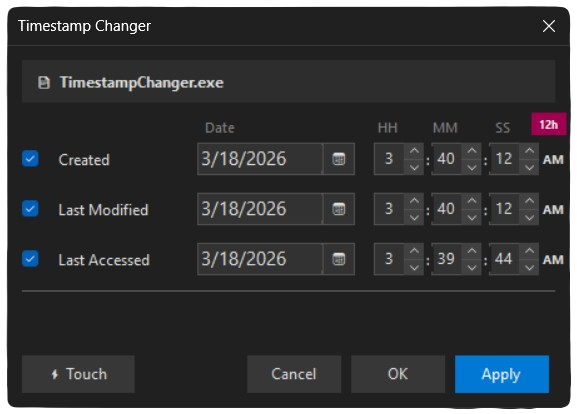

#  TimestampChanger

A lightweight Windows utility to edit file timestamps directly from the right-click context menu.

  

##  Features
- Edit Created, Last Modified, and Last Accessed timestamps
- Multi-file support — select multiple files and change them all at once
- Built-in calendar picker
- 12h/24h time format toggle
- Dark mode support

##  Installation
1. Download the latest release
2. Place all 3 files in the same folder
3. Run Install.exe (requires admin)
4. Right-click any file or folder → Show more options → Change Timestamps

##  Uninstall
Run Uninstall.exe (requires admin)
